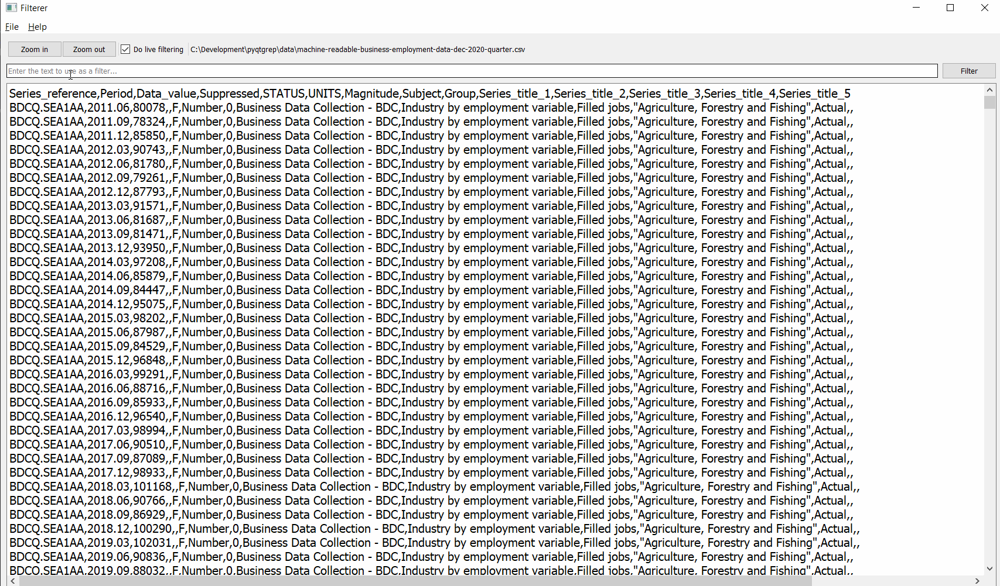

# pyqt-text-filterer

## Usage

This is a little utility GUI application for searching rows in 
a text file containing a search string and optionally saving a 
new file containing only the rows with the search string.



It has been created for experimenting using 
[pyinstaller](https://pyinstaller.readthedocs.io/en/stable/usage.html) on 
Windows to build an executable file that can launch a GUI application. 
The built executable can be distributed as is and the user doesn't need to 
use any Python related commands to launch the application.

To build the application, run:

```bash
$ pyinstaller Filterer.py
```

This will produce a `dist` directory containing the executable along with all
libraries that are required for the application to run. The `dist` directory 
can be zipped and distributed. The archive file will need to be unpacked and 
then one can run the `Filterer.exe` file.

## Development

The `chartests` directory contains the sample files in various encodings
which are helpful for testing that the application can handle text files
in various encodings.
